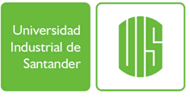

# Analisis y Tratamiento de Datos en Química

Este es una asignatura electiva del programa de Química de la Universidad Industrial de Santander.  La asignatura se desarrolla
en Python utilizando como herramientas de trabajo los Cuaderno de Jupyter (*Jupyter Notebook*). El Objetivo del curso es que los estudiantes 
del programa utilicen herramientas computacionales que le permitan inspecionar, visualizar y procesar los datos científicos a partir del análisis estadístico
descriptivo.
  
